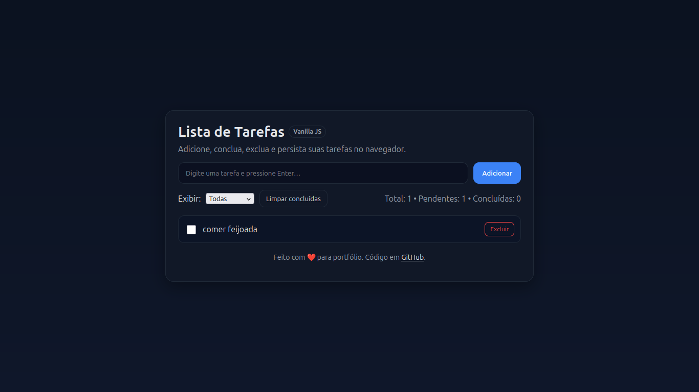
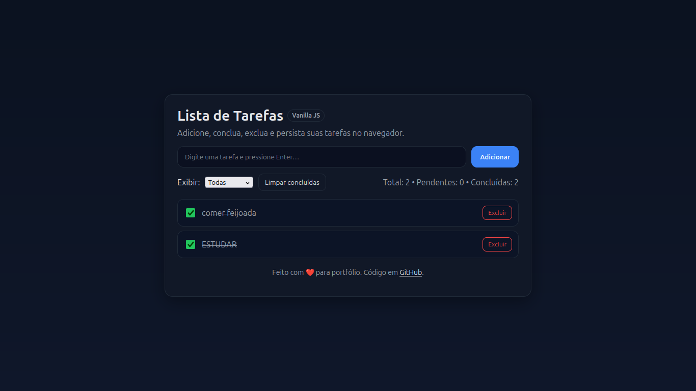

To-Do List

Acabei de finalizar meu projeto de To-Do List! 

Criei essa aplicação como parte do meu estudo em desenvolvimento web, usando HTML, CSS e JavaScript. O projeto permite:

- Adicionar tarefas

- Marcar tarefas como concluídas

 -Remover tarefas

É um projeto simples, mas que serve como portfólio e experiência prática para futuros trabalhos e oportunidades.

Tecnologias:

HTML

CSS

JavaScript

Como usar:

Clone o repositório:

git clone https://github.com/leandro-amaro/todo-list.git

Abra o projeto em seu editor de código (por exemplo, VS Code).

Abra o arquivo index.html no navegador.

Screenshots

Links

Código completo no GitHub: https://github.com/leandro-amaro/todo-list

Seguindo este README, qualquer pessoa poderá entender, usar e avaliar seu projeto. Ele já está pronto para ser mostrado como portfólio.

#Portfólio #Estudo #DesenvolvimentoWeb #ToDoList #GitHub #Projetos #BoasPráticas

